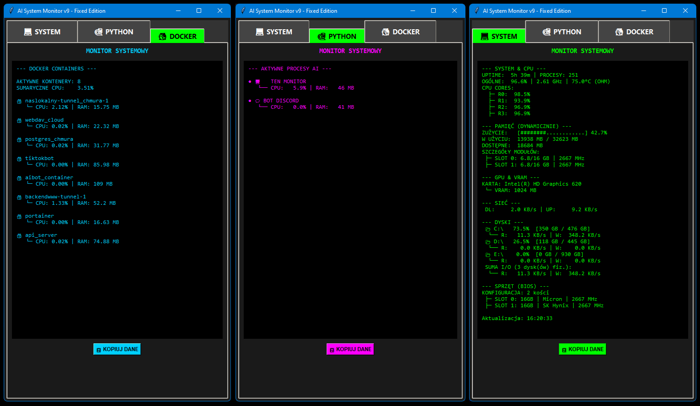

# System Monitor

&#x20;Funkcje:

* CPU / RAM - Dokładnie rozpisane rdzenie oraz moduły RAM
* Sieć - Prędkość wysyłania i pobierania danych
* Karta oraz Vram
* Docker - Wszystkie kontenery, z rozpisaniem na zużycie CPU/RAM
* Python - Wszystkie procesy Pythona, z rozpisaniem na zużycie CPU/RAM
* Tkinter GUI

&#x20;Ważne wymagania:

* Wyświetlanie temperatury wymaga włączonego programu \*\*Open Hardware Monitor\*\*!
* Pobierz go tutaj: \[openhardwaremonitor.org](https://openhardwaremonitor.org/)

&#x20;Współtwórcy:

* \[Claude.ai](https://claude.ai)
* \[Gemini.google.com](https://gemini.google.com)

Funkcje sprawdzające procesy python mają nazwy dostosowane po moje osobiste aplikacje.
